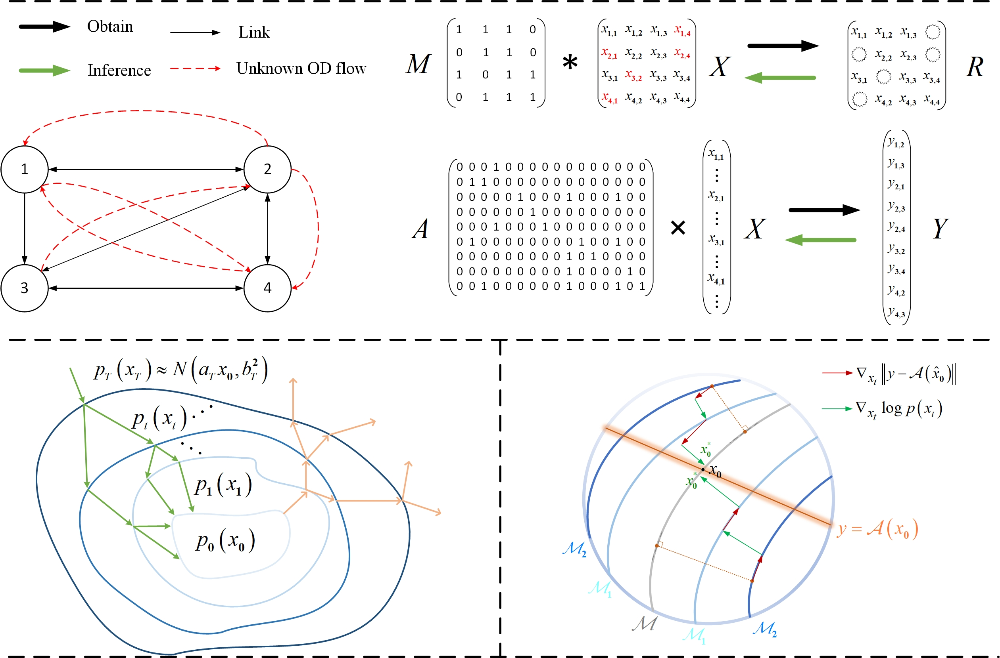

# Official Implementation of "Diffusion Models Meet Network Management: Improving Traffic Matrix Analysis with Diffusion-based Approach"

This is the official repository of IEEE Transactions on Network and Service Management (TNSM) paper "[Diffusion Models Meet Network Management: Improving Traffic Matrix Analysis with Diffusion-based Approach](https://arxiv.org/abs/2411.19493)".

[](https://www.python.org/downloads/release/python-3813/)
[](https://pytorch.org/)
[](https://github.com/kumar-shridhar/PyTorch-BayesianCNN/blob/master/LICENSE)
[](https://arxiv.org/abs/2411.19493)

We proposed a diffusion-based traffic matrix analysis framework named **Diffusion-TM**, which leverages problem-agnostic diffusion to notably elevate the estimation performance in both traffic distribution and accuracy. The novel framework not only takes advantage of the powerful generative ability of diffusion models to produce realistic network traffic, but also leverages the denoising process to unbiasedly estimate all end-to-end traffic in a plug-and-play manner under theoretical guarantee. Moreover, taking into account that compiling an intact traffic dataset is usually infeasible, we also developed a two-stage training scheme to make our framework be insensitive to missing values in the dataset. 

<p align="center">

<br>
<b>Figure 1.</b> Solving TM-related problems in network management through diffusion processes.
</p>

---------------------------------------------------------------------------------------------------------

## How to perform standard experiments ?

**Step 1.** Install Python 3.8, and the required dependencies. 

**Step 2.** Required dependencies can be installed by: ```pip install -r requirements.txt```

**Step 3.** To train and evaluate on a dataset, you can directly run the python scripts:
```train & evaluate
python train_run_<dataset_name>.py --flow_known_rate <rate_1> --link_known_rate <rate_2> --mode <TMEC>
```

The detailed descriptions about the arguments are as following:
| Parameter name | Description of parameter |
| --- | --- |
| dataset_name | The dataset name. This can be set to abilene, or geant|
| flow_known_rate | The sampling ratio of TMs in both training and testing datasets. This can be set to any value between 0~1 (defaults to 0.1) |
| link_known_rate | The sampling ratio of link loads during inference. This can also be set to any value between 0~1 (defaults to 0.0) |
| mode | The experience type of TM analysis. This can be set to TME for network tomography, TMC for TM completion, or TMEC of both (defaults to TME) |

(For descriptions of more arguments, run `python train_run_<dataset_name>.py -h`.)

## Repository Structure

- `Data`: This directory stores two real-world datasets.
  - `abilene_rm.csv`: Stores routing matrix of Abilene backbone network.
  - `abilene_tm.csv`: Stores traffic matrices of Abilene backbone network.
  - `geant_rm.csv`: Stores routing matrix of GÉANT backbone network.
  - `geant_rm.csv`: Stores traffic matrices of GÉANT backbone network.
- `DDPM`: This directory stores the codes for runing Diffusion-TM.
  - `diffusion_model.py`: Implements the diffusion-based generative framework.
  - `preprocessing_model.py`: Implements the Bi-RNN-based autoencoder for preprocessing missing TMs.
  - `underlying_model.py`: Implements the Transformer-based denosing network.
- `Train_utils`: This directory stores the codes related to the two-stage training scheme.
  - `lr_schedule.py`: Some codes for scheduling learning rate.
  - `trainer.py`: Implements the experience tool for training and inference.
- `Utils`: This directory stores some useful functions and classes.
  - `data_utils.py`: Implements dataset classes that wraps the experience pool.
  - `em_utils.py`: Implements EM algorithms for TM estimation.
  - `metric_utils.py`: Some codes for testing the performance of solutions.
  - `plot_utils.py`: Some codes for TNSE and PCA plotting.
  - `random_utils.py`: Some codes for simulating missing scenarios (masking partial OD-pairs randomly).
- `train_run_abilene.py`: The main file for running on abilene dataset.
- `train_run_geant.py`: The main file for running on geant dataset.

## Citation

If you are using this work, please cite:

```
@article{yuan2025diffusion,
  title={Diffusion Models Meet Network Management: Improving Traffic Matrix Analysis With Diffusion-Based Approach},
  author={Yuan, Xinyu and Qiao, Yan and Wei, Zhenchun and Zhang, Zeyu and Li, Minyue and Zhao, Pei and Hu, Rongyao and Li, Wenjing},
  journal={IEEE Transactions on Network and Service Management},
  year={2025},
  publisher={IEEE}
}
```

## Authors & Contact

Please contact us for any questions.

- [Xinyu Yuan](https://y-debug-sys.github.io/) - [yxy5315@gmail.com](yuanxinyu:yxy5315@gmail.com)
- [Yan Qiao](http://faculty.hfut.edu.cn/qiaoyan/en/index.htm) -  [qiaoyan@hfut.edu.cn](qiaoyan:qiaoyan@hfut.edu.cn)
